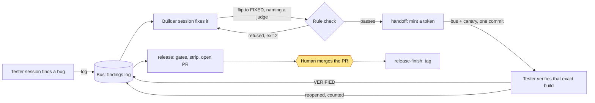

# dev-utils: the mechanical half of an AI build loop

> Part of [the gs-admin toolchain](../gs-admin-toolchain/README.md). It keeps the books for the
> builder/tester loops that the superfriends skills define, so the AI sessions spend their
> effort on judgment.
> Private repository · shipped (v0.5.1) · measured 2026-10-05 at `origin/main` (c2ebd66)

## The problem

I build tools with two AI sessions working against each other: a builder that writes fixes and
a tester that tries to break them. They coordinate through a shared log of findings (the
"bus"), and someone has to keep its books: which findings are open, which fix was verified
against which build, and whether a release is allowed. Left to the AI sessions, that
bookkeeping costs model tokens on work that needs no thought. It also fails in ways that are
hard to see: a mis-edited log, a verification run against the wrong build, a release that
skipped a gate. The model is worth paying for when it decides whether a fix is right, and it
is wasted on splicing a markdown file.

## What I built

A single Python CLI (standard library only, no credentials) that does the deterministic half
of both loops, so the skills that run the AI sessions keep the judgment half.

- **15 verbs, one per mechanical step.** Logging a finding, flipping its status with a dated
  note, handing a build to the tester, linting the log, archiving, and the release ceremony.
  Each verb takes the judgment as an argument (`--note`, `--judge`, `--why`) and does the
  edit, so a session decides and the tool records.
- **Provenance tokens.** A handoff mints a token (`hb-<date>-<nn>`) into the bus and into a
  canary file inside the build, in one commit. The tester checks that the token in the build
  it loaded matches the token on the bus before it tests anything.
- **Rules that refuse rather than warn.** A fix that names a defect class must name an
  independent judge, and a finding reopened twice must name the design it replaces. A flip
  that breaks either rule exits with code 2 and leaves the log unchanged. There is no
  `--force`. The only override is a WONTFIX or DEFERRED ruling, which stays on the record.
- **The release ceremony as code.** Re-decide stale deferrals, run the gates, bump the
  version, strip dev-only files as the only commit beyond `dev`, run the validation, open a
  pull request, and stop. A human merges. Tagging is refused until GitHub reports the PR as
  merged.
- **Two loops, one tool.** The single-machine loop keeps its bus in one markdown file. The
  multi-user loop keeps it in GitHub Issues and proves provenance by commit ancestry. A verb
  run against the wrong loop is refused with a pointer to the right one.
- **A drift alarm on its own spec.** The tests pin a hash of the skill files that define
  the formats it parses. When a skill changes, the pins go red and are re-pinned
  deliberately, in a commit that names the upstream change.

## The framework

**Judgment stays with the model; mechanics go to code.** It is the same boundary as "AI
proposes, rules execute" in an agent deployment. The skills stay the source of truth for
fixing findings, verifying repros, code review and WONTFIX rulings. The CLI parses and emits
exactly the formats the skills define, and the skill-pin tests enforce that. Even the release
keeps the line: the gate *asks* whether `/code-review` ran on `dev` and refuses to continue
without a yes. It never reviews anything itself.

**Refuse, don't warn; an override is a ruling on the record.** Every gate fails with exit 2
and an unchanged log, naming the flag or ruling that would satisfy it. Deferring a finding
takes a "why not now" and a reopen trigger, and the release ceremony reopens every deferral
whose version has passed, so nothing is deferred for good by forgetting.

**Provenance comes from what the loop writes, never from prose.** The token mint reads only
the lines the loop itself writes (the "under test" line, verification notes, the canary) and
the handoff commits. A finding can quote any token in its text without moving the sequence.
The rule took two redesigns and several tunings to get right, each one a finding on the bus.

**Humans hold the irreversible steps.** The tool shells out to an already-authenticated `git`
and `gh`, stores no tokens and prompts for none. It never merges, and it never force-pushes
`dev`. The log is treated as untrusted repo content: a test suite checks that nothing parsed
from it can cause a write outside the repo or a second shell command.

## How it works



A tester session logs a finding. The builder fixes it and flips it to FIXED, and that flip is
where the rules fire: name a defect class and you must name a judge. A finding reopened twice
must carry a `Redesign:` line before it can be FIXED again. The handoff then mints a token
into the bus and the build in one commit. The tester confirms the build it loaded carries
that token, re-runs the repro, and flips the finding to VERIFIED or back to OPEN. The release
refuses while anything is unresolved. It then cuts the branch, opens the PR, and waits for a
person.

What the CLI owns, from its help screen (abridged):

```
Mechanics for the /dev-loop and /team-loop workflows.
  status           branch, mechanics, canary verdict, board, release gates
  log              log a finding (dev-loop section / team-loop issue or file)
  flip             flip a finding's status with a dated note
  severity         declare or re-declare a finding's tier with a dated note
  handoff          dev-loop: mint a token into the bus + canary, one commit
  lint             dev-loop: bus rules 4, 5 and B
  walk             dev-loop: record this round's skill walk
  archive          dev-loop: move VERIFIED/WONTFIX to the archive file
  claim            team-loop: assign a finding to the signed-in user
  sync             team-loop: pull --rebase, print the reload action, check the canary
  verify-ancestry  team-loop: prove the fix sha is in what you run
  release          run the gates, then the frozen release ceremony
  release-finish   post-merge only: tag at origin/main and clean up
  init             bootstrap a repo onto a loop (idempotent)
  migrate          migrate a dev-loop repo to team-loop
```

A deferral as the bus records it. The tester found the bug; deferring it was the owner's
call, and the release ceremony forced the call to be made again (abridged):

```
## F-029 — DEFERRED (past 0.5.1)
Severity: normal — reachable by any user with staged work
What: every committing verb sweeps changes the user already staged into its bus commit
Defer: 2026-09-29 (user) - past 0.5.0. Why not now: shipped unchanged since 0.4.0,
  so 0.5.0 makes nothing worse; never observed; when it happens nothing is lost.
  Still to be fixed: the verbs should commit exactly the paths they name.
  Reopen: the 0.6.0 release ceremony, the next change to the commit helper,
  or a first observed incident, whichever comes first.
Reopened: 2026-10-04 (release ceremony) — re-decided for 0.5.1: fix, WONTFIX,
  or defer again with a real trigger
Defer: 2026-10-04 (user) - past 0.5.1. Why not now: 0.5.1 exists to ship F-030,
  which is refusing correct handoffs in another repo today.
```

And the fix the release shipped, with the judge and the redesign the rules demanded
(abridged):

```
## F-030 — VERIFIED
What:     handoff refuses a correct handoff when a later handoff re-stamped its token
Class:    minted-token-off-the-lines
Judge:    the real instance, on a local clone of the repo where it happened: the
          previous build refuses (exit 2), this build mints the next token; the
          refusal paths for a never-minted token still refuse
Redesign: tokens were derived only from the current provenance lines, mutable state
          every handoff overwrites. The set now adds the immutable record of the
          mint itself: the handoff commit
Verified: 2026-10-04 (tester) — re-verification round, pass bar stated before
          measuring; differential against the previous build
```

## Proof

Measured 2026-10-05 at `origin/main` (c2ebd66). Commands run from the folder holding the
clone; the full table is in [proof/stats.md](proof/stats.md).

| Measure | Value | How to check |
|---|---|---|
| Findings on the bus (live + archive) | 31: 28 verified, 1 WONTFIX, 2 deferred | `git -C dev-utils show c2ebd66:dev/FEEDBACK.md c2ebd66:dev/FEEDBACK-archive.md \| grep -oE '^## F-[0-9]+ — [A-Z]+' \| sed 's/.* — //' \| sort \| uniq -c` |
| Fixes carrying an independent `Judge:` line | 26 | `git -C dev-utils show c2ebd66:dev/FEEDBACK.md c2ebd66:dev/FEEDBACK-archive.md \| grep -c '^Judge:'` |
| Fixes that name the design they replace (`Redesign:`) | 4 | `git -C dev-utils show c2ebd66:dev/FEEDBACK.md c2ebd66:dev/FEEDBACK-archive.md \| grep -c '^Redesign:'` |
| Release tags | 6 (v0.2.0 to v0.5.1) | `git -C dev-utils tag --merged c2ebd66 \| wc -l` |
| Merged pull requests | 30 | `gh pr list -R BradleyDB/dev-utils --state merged --limit 2000 --json number --jq length` |
| Deliberate re-pins to the skill spec | 13 commits | `git -C dev-utils log c2ebd66 --format=%s \| grep -ci 're-pin'` |
| Python source | 5,351 lines in 13 files | `git -C dev-utils grep -I -c '' c2ebd66 -- '*.py' ':!tests/' \| awk -F: '{s+=$NF} END {print s}'` |
| Tests | 5,199 lines in 20 files (15 test modules plus the runner, a fake `gh` and fixtures); 240 test cases | `git -C dev-utils grep -I -c '' c2ebd66 -- 'tests/*.py' \| awk -F: '{s+=$NF} END {print s}'` for lines; `git -C dev-utils grep -c 'def test_' c2ebd66 -- tests \| awk -F: '{s+=$NF} END {print s}'` for cases |
| Commits | 237 over 12 active days, 2026-07-22 to 2026-10-04 | `git -C dev-utils rev-list --count c2ebd66` |
| CI workflows | 0: the suite runs locally, as the release's validation step | `git -C dev-utils ls-tree -r --name-only c2ebd66 -- .github/workflows \| wc -l` |

Line counts are physical lines, blanks and comments included. It is solo work: no merged PR
is from anyone else. The suite is fully offline: the GitHub side is tested against a fake
`gh` that answers from canned JSON.

## What this shows

| Role duty | Where this work does it | Evidence |
|---|---|---|
| Decision log | The bus: every status change, severity declaration and deferral is a dated line with its reason; a deferral carries a reopen trigger | 31 findings; F-029 above |
| Architecture principles | Judgment/mechanics split, enforced by frozen formats and the skill-pin tests; refusals instead of warnings | 13 re-pin commits; exit-2 gates, no `--force` |
| Dependency map | The CLI depends on the skill text; the pin tests turn that dependency into an alarm, and fixes name the consumers they touch | each re-pin commit names the upstream change |
| Change control | Release ceremony: re-decide deferrals, gate, single strip commit, PR, human merge, tag only after merged | 6 tags, 30 merged PRs |
| Agent evaluation | A tester session verifies each fix against a minted token; a fix needs a judge independent of the fixer | 28 verified findings, 26 `Judge:` lines |
| Agent escalation | The tool stops and hands the call to a person: refusals name the ruling needed, the release stops at the PR, the review gate asks | F-029's two deferrals were the owner's, not the tool's |

Not yet: the multi-user half is tested only against the fake `gh`, and there is no CI. The
CLI-backed versions of the loop skills are still under evaluation; the hand-run skills remain
the default.

## What's private and why

- **Private:** dev-utils and the skills it serves (superfriends). They are personal
  infrastructure: the bus records machine paths and dated working notes from other private
  repos, and the tests read a local checkout of the skills.
- **Public and checkable:** the companion tool this loop is used on,
  [gs-superadmin](https://github.com/BradleyDB/gs-admin-cli-docs). The system page,
  [the gs-admin toolchain](../gs-admin-toolchain/README.md), shows where dev-utils sits
  among the other repos.
- **Numbers:** every figure above comes with the command that reproduces it. Readers can't
  rerun commands against a private repo, so I'm happy to run any of them live in a
  walkthrough.
