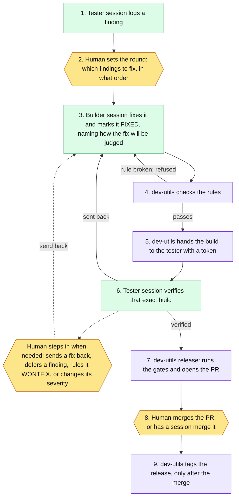

# dev-utils

**AI builder and tester sessions check each other's work. dev-utils keeps their books, so the models spend their effort on judgment instead of bookkeeping.**

<table><tr>
<td align="center" width="25%"><h2>240</h2>test cases over 5,199 lines of tests</td>
<td align="center" width="25%"><h2>31</h2>findings through the loop, 28 verified</td>
<td align="center" width="25%"><h2>26</h2>fixes that named an independent judge of their correctness</td>
<td align="center" width="25%"><h2>6</h2>releases from 30 merged pull requests, each merge a person's call</td>
</tr></table>

> [!IMPORTANT]
> **Judgment stays with the model; mechanics go to code.** It's the same boundary as "AI
> proposes, rules execute" in an agent deployment.

Part of the [gs-admin toolchain](../gs-admin-toolchain/README.md): the mechanics of its
build loop. Private repository · shipped (v0.5.1) · measured 2026-10-05.

## In 30 seconds

- **The problem.** Two AI sessions work against each other: a builder writes fixes, a
  tester tries to break them. Someone has to keep the shared log of findings (the "bus"):
  what's open, which build was verified, whether a release may ship. Done by the models,
  that's paid-for thinking spent on splicing a markdown file, and it fails quietly: a
  mis-edited log, a test run against the wrong build, a skipped gate.
- **What I built.** A standard-library Python CLI with one verb per mechanical step. The
  session decides; the tool records, and refuses anything that breaks the loop's rules.
- **The proof.** 31 findings through the loop, a token on every handoff, and a release
  ceremony that stops at the pull request.

## How it works



Green is an AI session, purple is dev-utils, yellow is a person. Dotted lines are where a
person steps in when a round needs it, not on every finding.

<details>
<summary><b>The loop, step by step</b></summary>

A tester session logs a finding (1). I choose which findings a round fixes and in what
order (2). The builder fixes one and flips it to FIXED (3), and that flip is where the rules
fire (4): name a defect class and you must name a judge, and a finding reopened twice must
carry a `Redesign:` line before it can be FIXED again. The handoff mints a token into the
bus and the build in one commit (5). The tester confirms the build it loaded carries that
token, re-runs the repro, and flips the finding to VERIFIED or sends it back (6). I step in
when a round needs it, and each intervention is a dated line on the bus. The release
refuses while anything is unresolved, then cuts the branch and opens the PR (7). It waits
for a person to merge, or to have a session merge (8), and only then tags (9).

</details>

<details>
<summary><b>What I built, piece by piece</b></summary>

- **15 verbs, one per mechanical step**: logging, flipping a status with a dated note,
  handoff, lint, archive, the release ceremony. Each takes the judgment as an argument
  (`--note`, `--judge`, `--why`) and does the edit.
- **Provenance tokens.** A handoff mints a token (`hb-<date>-<nn>`) into the bus and a
  canary file in the build, in one commit. The tester checks they match before testing.
- **Rules that refuse rather than warn.** A rule-breaking flip exits with code 2 and leaves
  the log unchanged. There is no `--force`; the only override is a WONTFIX or DEFERRED
  ruling, which stays on the record.
- **The release ceremony as code.** Re-decide stale deferrals, run the gates, bump the
  version, strip dev-only files as the only commit beyond `dev`, validate, open the PR, and
  stop. A person merges it, or has a session merge it; the tool never does. Tagging is
  refused until GitHub reports the merge.
- **Two loops, one tool.** The single-machine loop keeps its bus in a markdown file; the
  multi-user loop uses GitHub Issues and proves provenance by commit ancestry.
- **A drift alarm on its own spec.** Tests pin a hash of the skill files that define the
  formats it parses. A skill change turns them red until deliberately re-pinned.

</details>

<details>
<summary><b>The four design rules</b></summary>

- **Judgment stays with the model.** The skills own fixes, verdicts, code review and
  WONTFIX rulings. The CLI emits exactly the formats they define, and the pin tests
  enforce it. Even the release *asks* whether `/code-review` ran; it never reviews.
- **Refuse, don't warn; an override is a ruling on the record.** Deferring takes a "why not
  now" and a reopen trigger, and each release reopens deferrals whose version has passed.
- **Provenance comes from what the loop writes, never from prose.** The token mint reads
  only loop-written lines and the handoff commits. Getting this right took two redesigns,
  each one a finding on the bus.
- **Humans hold the irreversible steps.** The tool uses the already-authenticated `git` and
  `gh`, stores no credentials, never merges and never force-pushes `dev`. Bus text is
  treated as untrusted: a test suite checks nothing parsed from it can write outside the
  repo or run a second shell command.

</details>

<details>
<summary><b>Excerpts: the help screen, a deferral, and a fix the rules demanded</b></summary>

What the CLI owns, from its help screen (abridged):

```
Mechanics for the /dev-loop and /team-loop workflows.
  status           branch, mechanics, canary verdict, board, release gates
  log              log a finding (dev-loop section / team-loop issue or file)
  flip             flip a finding's status with a dated note
  severity         declare or re-declare a finding's tier with a dated note
  handoff          dev-loop: mint a token into the bus + canary, one commit
  lint             dev-loop: bus rules 4, 5 and B
  walk             dev-loop: record this round's skill walk
  archive          dev-loop: move VERIFIED/WONTFIX to the archive file
  claim            team-loop: assign a finding to the signed-in user
  sync             team-loop: pull --rebase, print the reload action, check the canary
  verify-ancestry  team-loop: prove the fix sha is in what you run
  release          run the gates, then the frozen release ceremony
  release-finish   post-merge only: tag at origin/main and clean up
  init             bootstrap a repo onto a loop (idempotent)
  migrate          migrate a dev-loop repo to team-loop
```

A deferral as the bus records it. Deferring was the owner's call, and the release ceremony
forced the call to be made again (abridged):

```
## F-029 — DEFERRED (past 0.5.1)
Severity: normal — reachable by any user with staged work
What: every committing verb sweeps changes the user already staged into its bus commit
Defer: 2026-09-29 (user) - past 0.5.0. Why not now: shipped unchanged since 0.4.0,
  so 0.5.0 makes nothing worse; never observed; when it happens nothing is lost.
  Still to be fixed: the verbs should commit exactly the paths they name.
  Reopen: the 0.6.0 release ceremony, the next change to the commit helper,
  or a first observed incident, whichever comes first.
Reopened: 2026-10-04 (release ceremony) — re-decided for 0.5.1: fix, WONTFIX,
  or defer again with a real trigger
Defer: 2026-10-04 (user) - past 0.5.1. Why not now: 0.5.1 exists to ship F-030,
  which is refusing correct handoffs in another repo today.
```

The fix that release shipped, with the judge and the redesign the rules demanded (abridged):

```
## F-030 — VERIFIED
What:     handoff refuses a correct handoff when a later handoff re-stamped its token
Class:    minted-token-off-the-lines
Judge:    the real instance, on a local clone of the repo where it happened: the
          previous build refuses (exit 2), this build mints the next token; the
          refusal paths for a never-minted token still refuse
Redesign: tokens were derived only from the current provenance lines, mutable state
          every handoff overwrites. The set now adds the immutable record of the
          mint itself: the handoff commit
Verified: 2026-10-04 (tester) — re-verification round, pass bar stated before
          measuring; differential against the previous build
```

</details>

## What this shows

| The job | Where dev-utils does it | Evidence |
|---|---|---|
| **Decision log** | Every status change, severity call and deferral is a dated line with its reason; a deferral carries a reopen trigger | 31 findings; F-029 |
| **Architecture principles** | The judgment/mechanics split, enforced by frozen formats and pin tests; refusals instead of warnings | 13 re-pin commits; exit-2 gates, no `--force` |
| **Dependency map** | The CLI depends on the skill text, and the pin tests turn that dependency into an alarm | each re-pin names the upstream change |
| **Change control** | Re-decide deferrals, gate, one strip commit, PR, a person's merge, tag only after merge | 6 tags, 30 merged PRs |
| **Agent evaluation** | A separate tester session verifies each fix against a token-proven build; a fix needs an independent judge | 28 verified, 26 `Judge:` lines |
| **Agent escalation** | Refusals name the ruling needed, the release stops at the PR, the review gate asks | F-029's deferrals were the owner's |

## Proof

| Commits | Release tags | Merged PRs | Findings (verified) | Source lines | Test lines | Test cases |
|---:|---:|---:|---:|---:|---:|---:|
| 237 | 6 | 30 | 31 (28) | 5,351 | 5,199 | 240 |

<details>
<summary><b>Every number with the command that reproduces it</b></summary>

Measured 2026-10-05 at `origin/main` (c2ebd66), run from the folder holding the clone. The
full table is in [proof/stats.md](proof/stats.md).

| Measure | Value | How to check |
|---|---|---|
| Findings on the bus (live + archive) | 31: 28 verified, 1 WONTFIX, 2 deferred | `git -C dev-utils show c2ebd66:dev/FEEDBACK.md c2ebd66:dev/FEEDBACK-archive.md \| grep -oE '^## F-[0-9]+ — [A-Z]+' \| sed 's/.* — //' \| sort \| uniq -c` |
| Fixes carrying an independent `Judge:` line | 26 | `git -C dev-utils show c2ebd66:dev/FEEDBACK.md c2ebd66:dev/FEEDBACK-archive.md \| grep -c '^Judge:'` |
| Fixes that name the design they replace (`Redesign:`) | 4 | `git -C dev-utils show c2ebd66:dev/FEEDBACK.md c2ebd66:dev/FEEDBACK-archive.md \| grep -c '^Redesign:'` |
| Release tags | 6 (v0.2.0 to v0.5.1) | `git -C dev-utils tag --merged c2ebd66 \| wc -l` |
| Merged pull requests | 30 | `gh pr list -R BradleyDB/dev-utils --state merged --limit 2000 --json number --jq length` |
| Deliberate re-pins to the skill spec | 13 commits | `git -C dev-utils log c2ebd66 --format=%s \| grep -ci 're-pin'` |
| Python source | 5,351 lines in 13 files | `git -C dev-utils grep -I -c '' c2ebd66 -- '*.py' ':!tests/' \| awk -F: '{s+=$NF} END {print s}'` |
| Tests | 5,199 lines in 20 files (15 test modules plus the runner, a fake `gh` and fixtures); 240 test cases | `git -C dev-utils grep -I -c '' c2ebd66 -- 'tests/*.py' \| awk -F: '{s+=$NF} END {print s}'` for lines; `git -C dev-utils grep -c 'def test_' c2ebd66 -- tests \| awk -F: '{s+=$NF} END {print s}'` for cases |
| Commits | 237 over 12 active days, 2026-07-22 to 2026-10-04 | `git -C dev-utils rev-list --count c2ebd66` |
| CI workflows | 0, by choice: the suite runs locally as the release's validation step | `git -C dev-utils ls-tree -r --name-only c2ebd66 -- .github/workflows \| wc -l` |

Line counts are physical lines, blanks and comments included. No merged PR is from anyone
else. The suite is fully offline: the GitHub side is tested against a fake `gh`.

</details>

## Trade-offs

- **No CI, by choice.** One maintainer, a private repo, and a suite that runs locally as a
  required step of every release. Its skill-pin tests also read a second private repo
  that CI would need access to.
- **The multi-user half** is tested only against the fake `gh`.
- **Still under evaluation:** the CLI-backed versions of the loop skills are opt-in; the
  hand-run skills remain the default.

## What's private and why

dev-utils and the skills it serves are personal infrastructure: the bus holds machine paths
and working notes from other private repos, and the tests read a local checkout of the
skills. The public tool this loop builds is
[gs-superadmin](https://github.com/BradleyDB/gs-admin-cli-docs), and the
[system page](../gs-admin-toolchain/README.md) shows where dev-utils fits. I'm happy to
rerun any number here live in a walkthrough.
