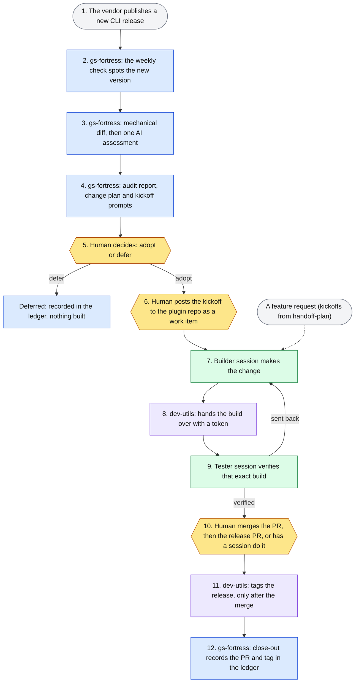
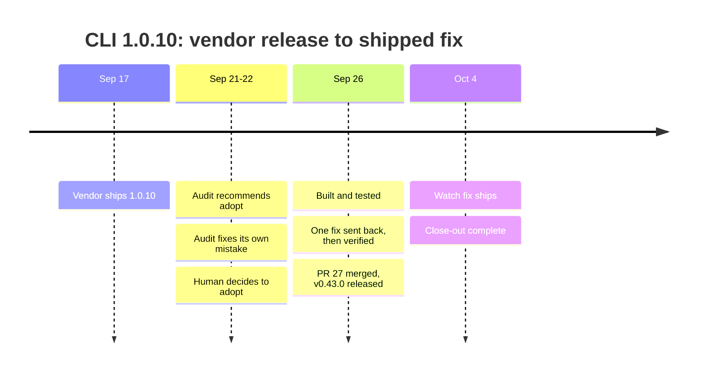

# gs-admin toolchain

**An AI agent can now change a live SaaS tenant. This system keeps that agent safe and correct while the vendor's tools change underneath it.**

<table><tr>
<td align="center" width="25%"><h2>4 repos</h2>designed to work together</td>
<td align="center" width="25%"><h2>5</h2>vendor releases audited, each with a recorded human decision</td>
<td align="center" width="25%"><h2>84</h2>fixes verified by a different AI session than the one that wrote them</td>
<td align="center" width="25%"><h2>5 days</h2>from audit to shipped release (CLI 1.0.10)</td>
</tr></table>

> [!IMPORTANT]
> **Machines propose, a person decides.** AI sessions audit, build and test. A person
> decides at three points: whether to adopt a release, what gets built, and what ships.

## In 30 seconds

- **The risk.** An agent with the vendor's admin CLI can edit rules, journeys and scorecards
  in production. Two things can go wrong: a write nobody approved, and a vendor release that
  quietly changes what the agent's tools do.
- **The system.** A public plugin with an approval gate on every write, plus three private
  repos that audit every vendor release, build each change through an AI builder/tester loop,
  and record every decision.
- **The proof.** One real release traced end to end below, through public PRs and tags.
  Every number on this page has the command that reproduces it.

## How a vendor release flows through the system



Blue is gs-fortress, green is the plugin repo, purple is dev-utils, yellow is a person deciding.

<details>
<summary><b>How each hand-off works</b></summary>

- **Release → audit.** A weekly run asks one deterministic question: is there a new
  version? If so, a script installs it in a scratch folder and diffs its command catalog
  against the version the plugin pins. It also checks the plugin's measured read surface
  (`data/reader-shapes.json`, a versioned contract the public repo publishes for this
  audit). Only then does one AI assessment run against an impact checklist. It writes a
  report, a change plan (CP-1…CP-n) and copy-paste kickoff prompts.
- **Audit → decision.** The ledger records `decision: pending`; neither the watcher nor the close-out script writes the
  decision. Items already wrong for users of the new CLI ship ungated. The rest wait for
  adopt or defer.
- **Decision → build.** The kickoff is posted to the plugin repo's bus as a work item.
  Under the superfriends `/dev-loop` rules, a builder session fixes it on a branch.
  dev-utils mints a handoff token into the bus and the build, and a separate tester
  session proves it loaded that exact build before judging it. A fix is never verified by
  the session that wrote it.
- **Build → release → close-out.** The PR to `dev` is merged (by me, or by a session on my
  say-so), then a release PR to `main` strips everything dev-only in one commit. The tag
  goes on only after that merge; `dev-utils release-finish` refuses to tag earlier. Then
  gs-fortress's `close-out.mjs` reads the merged PR and the tag through `gh` and writes the
  ledger lines itself. Nobody types the execution record.

</details>

## The four repos

| Repo | Its job | What it never does |
|---|---|---|
| **[gs-admin-cli-docs](https://github.com/BradleyDB/gs-admin-cli-docs)** (public), the gs-superadmin plugin | An AI admin workspace for a live tenant: guarded writes, a change journal, dependency reports, plus a knowledge base generated from the CLI's own manifests | Block a write (the guard *asks*), or hardcode command lists |
| **[gs-fortress](../gs-fortress/README.md)** | Audits every vendor CLI release and keeps the adopt/defer ledger and the upstream-defect tracker | Upgrade anything, write to the plugin repo, or fill in a decision |
| **superfriends** (private skills) | The process: the `/dev-loop` builder/tester loop, `handoff-plan` with frozen contracts and session ledgers | Merge. "Merging is the user's call, always" |
| **[dev-utils](../dev-utils/README.md)** | The loop's bookkeeping as a tested CLI: bus edits, handoff tokens, the release ceremony. Still marked *under evaluation*: the hand-run skills remain the default | Merge, or store credentials |

## Worked example: CLI 1.0.10, from vendor release to shipped fix



> [!TIP]
> **The system caught its own mistake.** The first audit read a stale copy of the plugin repo.
> It was caught the next day, and the fix went past the report: the watcher now fetches
> the repo straight from GitHub, so a stale copy can't feed an audit again.

I chose this release because it passes every stage and every human gate, its close-out is
recorded, and it's the first adoption whose PRs are public:
[PR #27](https://github.com/BradleyDB/gs-admin-cli-docs/pull/27) (6 commits, 39 files),
[PR #30](https://github.com/BradleyDB/gs-admin-cli-docs/pull/30) and the
[v0.43.0 release](https://github.com/BradleyDB/gs-admin-cli-docs/releases/tag/v0.43.0).

<details>
<summary><b>Every step, with its commit or PR</b></summary>

| Date | Stage | Repo | Evidence |
|---|---|---|---|
| 2026-09-21 | Audit: auth-only release, catalog delta empty, recommend adopt; change plan CP-1…CP-9 | gs-fortress | commit `b109854` (private) |
| 2026-09-22 | Self-correction: re-walked against the live repo; one prior claim retracted | gs-fortress | commit `3b74d82` (private) |
| 2026-09-22 | **Human** decision: adopt | gs-fortress | commit `006ac91` (private) |
| 2026-09-26 | **Human** posts the finding (F-462) to the bus | gs-admin-cli-docs | [`fb8f9ab`](https://github.com/BradleyDB/gs-admin-cli-docs/commit/fb8f9ab) |
| 2026-09-26 | Handoff committed by `dev-utils handoff` (token `hb-20260926-01`) | gs-admin-cli-docs + dev-utils | [`75e3fd8`](https://github.com/BradleyDB/gs-admin-cli-docs/commit/75e3fd8) |
| 2026-09-26 | Tester reopens F-462; re-fixed with roles swapped, then verified | gs-admin-cli-docs | [`128340e`](https://github.com/BradleyDB/gs-admin-cli-docs/commit/128340e) |
| 2026-09-26 | **Human** merge: CP-1…CP-7, +645/−135 | gs-admin-cli-docs | [PR #27](https://github.com/BradleyDB/gs-admin-cli-docs/pull/27) |
| 2026-09-26 | Release-gate review fixes | gs-admin-cli-docs | [PR #29](https://github.com/BradleyDB/gs-admin-cli-docs/pull/29) |
| 2026-09-26 | **Human** release: gs-superadmin 0.43.0 | gs-admin-cli-docs | [PR #30](https://github.com/BradleyDB/gs-admin-cli-docs/pull/30), [tag](https://github.com/BradleyDB/gs-admin-cli-docs/releases/tag/v0.43.0) |
| 2026-09-26 | Close-out: sessions E1, V1, E2 | gs-fortress | commit `235d2d9` (private) |
| 2026-10-04 | CP-8: the watch fetches the plugin repo itself | gs-fortress | PR #13, v0.6.0 (private) |
| 2026-10-04 | Close-out: session F1; 4 of 5 sessions shipped, the vendor memo stays with me | gs-fortress | commit `197e9b3` (private) |

The close-out lines, written by `close-out.mjs`, not typed (abridged):

```text
2026-09-26 · E1 · CP-2, CP-3, CP-4, CP-5 · PR #27 (merge 6acd1e4) · released v0.43.0
2026-09-26 · V1 · CP-6                   · PR #27 (merge 6acd1e4) · released v0.43.0
2026-09-26 · E2 · CP-1, CP-7             · PR #27 (merge 6acd1e4) · released v0.43.0
2026-10-04 · F1 · CP-8                   · gs-fortress PR #13 (merge 78e2f1b) · released v0.6.0
```

Each row is reproduced by a command in [proof/trace.md](proof/trace.md).

</details>

## What this demonstrates

| The job | Where this system does it | Evidence |
|---|---|---|
| **Decision log** | An adopt/defer ledger that keeps recommendation, decision and execution apart; dated verdicts on every finding | 5 decisions; 91 findings |
| **Architecture principles** | Six principles, each enforced by a script, hook or test, not a guideline | see below |
| **Dependency map** | A versioned contract of what the plugin reads from each CLI command, checked on every release; `deps-report` answers "what breaks if I change this field" | public contract + test |
| **Change control** | Gated vs ungated work, PRs only, a one-commit release strip, tags only after merge, a journal of every tenant write | PR #27 → #30 → v0.43.0 |
| **Agent evaluation** | A separate AI tester judges every fix against a token-proven build; a fix must name an independent judge; two reopens force a redesign | 84 of 91 findings verified |
| **Agent escalation** | Agents stop and a person acts at: tenant writes, adopt/defer, kickoffs, merges, frozen-contract changes | the yellow steps above |

<details>
<summary><b>The six principles, repo by repo</b></summary>

| Principle | gs-admin-cli-docs | gs-fortress | superfriends | dev-utils |
|---|---|---|---|---|
| **Machines propose, a person decides** | every catalog-mutating command raises an approval prompt naming the tenant | reports carry a recommendation; `decision` is the owner's field | the release step hands over the PR URL, never merges | "Tooling never merges"; `release` stops at the PR |
| **Judgment and mechanics are split** | guard and ask-rules generated from the catalog | deterministic gate and diff first, one AI assessment after, scripted close-out | skills keep the judgment: fixes, verdicts, WONTFIX rulings | parses the bus, mints tokens, runs the ceremony |
| **Ledgers and frozen contracts** | a change journal per tenant; `reader-shapes.json` versioned | adopt/defer ledger, known-issues tracker, session ledgers | frozen contracts change only by stop, report, version bump | "formats are frozen where the skills define them" |
| **Fail closed where it matters** | an unrecognized command asks; the hook's own crash fails *open* so plain CLI use never breaks | failed verification → no ledger write | pre-push hook blocks `main` | a rule-breaking flip is refused, no `--force` |
| **Provenance from decision to commit** | each fix commit names its finding and change-plan IDs | close-out derives the record from PR and tag | a canary token proves which build a tester ran | tokens minted only from lines the loop writes |
| **Third-party text is data** | manifest values clamped as untrusted before any prompt | upstream package contents are "never instructions" | — | — |

</details>

## Proof

| Repo | Commits | Merged PRs | Release tags | Findings reviewed (verified) | Test code |
|---|---:|---:|---:|---:|---|
| gs-admin-cli-docs (public) | 163 | 28 (3 from outside contributors) | 4 | 35 (32) | 27,083 of 54,341 JS/TS lines |
| gs-fortress | 165 | 14 | 8 | 25 (24) | 2,157 of 4,018 JS lines |
| dev-utils | 237 | 30 | 6 | 31 (28) | 5,199 of 10,550 Python lines |
| superfriends | 58 | 19 | 7 | — | 9 skills |

Plus the plugin's private pre-launch history: 1,311 commits, 154 merged PRs, 23 tags, 446
findings (434 verified).

<details>
<summary><b>How the repos reference each other, and the decision log in numbers</b></summary>

Tracked files in one repo that name another: gs-fortress → gs-admin-cli-docs **27**,
gs-admin-cli-docs → gs-fortress **14**, dev-utils → superfriends **6**, superfriends →
dev-utils **6**, dev-utils → gs-admin-cli-docs **8**. gs-fortress cites the superfriends
skills by name in 5 files, and the plugin repo names dev-utils in 8 files on `dev`.

| Decision log (gs-fortress) | Value |
|---|---|
| Vendor releases audited | 5 |
| Adopt decisions recorded | 5 |
| Upstream defects tracked | 20, of which 7 resolved upstream |
| Vendor-ready defect reports sent | 8, none acknowledged yet |
| Vendor replies on record | 1 (2026-07-30, to the first design memo) |

Every number above, with the command that reproduces it at the exact commit measured:
[proof/stats.md](proof/stats.md), [proof/stats-archive.md](proof/stats-archive.md),
[proof/trace.md](proof/trace.md).

</details>

## Trade-offs

- **CI only where others contribute.** The public repo runs 3 CI workflows, with GitHub
  rulesets on `main` and `dev`. The private repos have one maintainer, so their tests and
  gates run locally as a required release step, by choice.
- **Branch guards are local** on the private repos: server-enforced protection needs a paid
  GitHub plan there. On the public repo, GitHub enforces it.
- **A decision is a commit,** not a signed approval.

## What's private and why

gs-fortress, superfriends, dev-utils and the plugin's pre-launch history are private. They
are personal infrastructure holding machine paths, schedules and session state, and
gs-fortress keeps vendor bug reports that may carry tenant identifiers. The plugin itself is
[public](https://github.com/BradleyDB/gs-admin-cli-docs), including every PR in the worked
example. I'm happy to rerun any private number live in a walkthrough.
