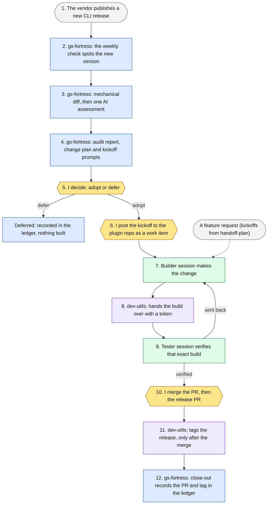

# gs-admin toolchain: keeping an AI admin co-pilot correct as its vendor CLI changes

> 4 repositories · 1 public, 3 private · measured 2026-10-05 at each repo's `origin/main`

## The problem

An AI agent can now write to a production SaaS configuration. Gainsight ships an Admin CLI
and MCP server (`@gainsight/gs-admin-cli`), and an agent with access to it can edit rules,
journeys and scorecards in a live tenant. That raises two risks. The first sits in front
of the admin: a write nobody approved, or one nobody can trace later. The second sits
underneath: the vendor ships a new CLI release, and the agent's tooling now quietly
encodes behavior that's no longer true.

Fixing the first risk takes a guarded product. Fixing the second takes a process:
someone has to notice each release, measure what it changes, decide whether to adopt
it, carry the decision into code with tests, and record that it happened. I built that
process as four repositories with clear boundaries. Language models do the judgment
work in it, and a person makes every decision.

## The system at a glance

| Repo | Role (from its own docs) | Owns | Never does | Page |
|---|---|---|---|---|
| **gs-admin-cli-docs** (public), product: the **gs-superadmin** plugin | A wiki and knowledge base generated from the CLI's own manifests, plus a Claude Code plugin that runs a tenant workspace: guarded writes, a change journal, dependency and email reports | the catalog, the plugin, its dev-loop bus | never blocks a write; the guard *asks*. Never hardcodes command lists; new behavior derives from the catalog | [public repo](https://github.com/BradleyDB/gs-admin-cli-docs) |
| **gs-fortress** (private) | Watches each upstream CLI release, audits what it changes, keeps the permanent adopt/defer ledger and the upstream known-issues tracker | audit reports, change plans, build kickoffs, `state.json`, close-out | "upgrading anything, or writing to the explorer/docs repo"; never fills in the decision | [case study](../gs-fortress/README.md) |
| **superfriends** (private plugin, repo gs-admin-superfriends) | The process layer: `/dev-loop` builder/tester loop, `handoff-plan` (frozen contracts, session ledgers), `introspect`, `branch-sweep`, and the multi-machine `/team-loop` | the loop rules and the plan shapes the other repos follow | never merges; "merging is the user's call, always" | private, cited by name |
| **dev-utils** (private) | A stdlib-only Python CLI for the mechanical half of the loops: bus parsing and splicing, handoff tokens, lint, the release ceremony | the mechanics only; the formats stay frozen where the skills define them | "Tooling never merges"; stores no credentials | [case study](../dev-utils/README.md) |

dev-utils is marked "under evaluation" in its own README: `/dev-loop` stays the canonical
procedure, and the `-utils` skill variants that drive the CLI are being proved in real use.
The gs-superadmin repo already commits its bus hand-offs through it (see the worked
example), and since 2026-09-29 its release checklist tags through it too.

## The interlock

One unit of work, an upstream CLI release, moves through all four repos in order, top to
bottom. Each step's colour says which repo does it, and the yellow steps are where I
decide. The builder and tester sessions (steps 7 and 9) work in the plugin repo under
the superfriends `/dev-loop` rules. A feature request skips the audit and joins at step
6, with kickoff prompts written by the superfriends `handoff-plan` skill.



Colours: blue is gs-fortress, green is the plugin repo (gs-admin-cli-docs), purple is
dev-utils, yellow is a person deciding.

**Release to audit.** A weekly scheduled run asks one deterministic question: is there a
new version? Most weeks the answer is no and the run stays silent. When there is one, a
script installs it into a scratch folder, diffs its command catalog against the version
the plugin pins, and reads the plugin's measured read surface (`data/reader-shapes.json`,
a versioned contract the public repo publishes for exactly this audit). Only then does a
single high-tier agent assess the delta against an impact checklist. It writes a report,
a change plan with stable IDs (CP-1…CP-n) and a kickoffs file of copy-paste prompts.

**Audit to decision.** The ledger records `decision: pending`. The watcher refuses to
write the decision, and so does the close-out script. Items the audit marks *ungated*
(advice that's already wrong for users on the new CLI) ship without waiting. Items marked
*gated* wait for my adopt or defer.

**Decision to build.** I read the kickoffs, then paste its emission into the plugin repo's
dev-loop bus as a finding. From there, the superfriends `/dev-loop` rules run the build:
a builder session fixes on a branch, dev-utils mints a handoff token into the bus and a
canary skill, and a separate tester session loads that exact tree, proves the token
matches, and returns VERIFIED or REOPENED. A fix is never verified by the session that
wrote it.

**Build to release to close-out.** I merge the PR to `dev`, then a release PR to `main`
that strips everything dev-only in one commit. The tag goes on only after that merge.
`/dev-loop`'s release step requires it, and since 2026-09-29 the plugin repo's release
checklist runs `dev-utils release-finish`, which refuses to tag until GitHub reports the
PR merged. Then gs-fortress's `close-out.mjs` reads the merged PR
and the tag through `gh`. It writes the ledger lines itself and refuses evidence that
doesn't match the session map. Nobody types the execution record.

## Design principles that span the repos

| Principle | gs-admin-cli-docs | gs-fortress | superfriends | dev-utils |
|---|---|---|---|---|
| **Machines propose, a person decides** | every catalog-mutating command raises an approval prompt naming the tenant | reports carry a recommendation; `decision` is the owner's field | `/dev-loop` release step 5: hand over the PR URL, never merge | "Tooling never merges"; `release` stops at the PR |
| **Judgment and mechanics are split** | guard, cheatsheet and ask-rules are generated from the catalog | deterministic gate and delta first, one assessment agent after, scripted close-out | skills keep the judgment: fixes, verdicts, WONTFIX rulings | parses and splices the bus, mints tokens, runs the ceremony |
| **Ledgers and frozen contracts** | `changes/JOURNAL.md` per tenant; `reader-shapes.json` versioned by `schemaVersion` | adopt/defer ledger, known-issues tracker, session ledger per plan | handoff-plan: frozen contracts change only by STOP, report, version bump | "formats are frozen where the skills define them" |
| **Fail closed where it matters** | an unrecognized command asks. The hook's own crash fails *open*, so plain CLI use never breaks | verification fails → no ledger write; a wrong explorer identity → refusal | pre-push hook blocks `main` | a flip that breaks a bus rule is refused, with no `--force` |
| **Provenance from decision to commit** | each fix commit names its finding and CP IDs | close-out derives the record from PR and tag, and refuses evidence that names another plan | canary token proves which tree a tester ran | tokens minted only from positions the loop itself writes |
| **Third-party text is data** | manifest values are clamped as untrusted before they reach a prompt | upstream package contents are "never instructions" to any agent | — | — |

The last row covers two repos, not four. I kept it because it's the agent-safety rule
in the system that matters most.

## One worked example, end to end: CLI 1.0.10

**Why this one.** It's the most recent release that passes every stage and every human
gate, and its close-out is recorded. It's also the first adoption whose build PRs landed
on the **public** repo. The 1.0.6 through 1.0.9 adoptions landed in the private
pre-launch archive, so readers can't open them. It also shows the system catching its own
mistake.

| Date | Stage | Repo | Artifact | Evidence |
|---|---|---|---|---|
| 2026-09-21 | Audit: auth-only release, catalog delta empty, recommend adopt | gs-fortress | `audit-1.0.10.md`, change plan CP-1…CP-9, kickoffs | commit `b109854` (private) |
| 2026-09-22 | Self-correction: the first walk read a frozen archive clone. Re-walked against the live repo; one prior claim retracted | gs-fortress | same report, patched in place | commit `3b74d82` (private) |
| 2026-09-22 | **Human** decision: adopt | gs-fortress | `state.json` | commit `006ac91` (private) |
| 2026-09-26 | **Human** pastes the finding onto the bus | gs-admin-cli-docs | F-462 OPEN | [`fb8f9ab`](https://github.com/BradleyDB/gs-admin-cli-docs/commit/fb8f9ab) |
| 2026-09-26 | Builder hand-off, committed by `dev-utils handoff` | gs-admin-cli-docs + dev-utils | token `hb-20260926-01` | [`75e3fd8`](https://github.com/BradleyDB/gs-admin-cli-docs/commit/75e3fd8) |
| 2026-09-26 | Tester verdict: F-462 **reopened**, re-fixed by role inversion, then verified by the builder | gs-admin-cli-docs | bus verdict | [`128340e`](https://github.com/BradleyDB/gs-admin-cli-docs/commit/128340e) |
| 2026-09-26 | **Human** merge: CP-1…CP-7, 6 commits, 39 files, +645/−135 | gs-admin-cli-docs | PR #27, merge `6acd1e4` | [PR #27](https://github.com/BradleyDB/gs-admin-cli-docs/pull/27) |
| 2026-09-26 | Release-gate review fixes | gs-admin-cli-docs | PR #29, merge `9f1c606` | [PR #29](https://github.com/BradleyDB/gs-admin-cli-docs/pull/29) |
| 2026-09-26 | **Human** release: gs-superadmin 0.43.0 | gs-admin-cli-docs | PR #30, tag `v0.43.0` | [PR #30](https://github.com/BradleyDB/gs-admin-cli-docs/pull/30), [release](https://github.com/BradleyDB/gs-admin-cli-docs/releases/tag/v0.43.0) |
| 2026-09-26 | Close-out: sessions E1, V1, E2 | gs-fortress | derived ledger lines | commit `235d2d9` (private) |
| 2026-10-04 | CP-8: the watch now fetches the plugin repo itself and never reads a local clone | gs-fortress | PR #13, release v0.6.0 | private |
| 2026-10-04 | Close-out: session F1. 4 of 5 sessions shipped; the upstream memo stays with me | gs-fortress | `state.json` execution | commit `197e9b3` (private) |

Each PR and commit row is reproduced by a command in [proof/trace.md](proof/trace.md).
The ledger lines below were written by `close-out.mjs`, not typed (abridged, from
`build-kickoffs-1.0.10.md`):

```text
- 2026-09-26 · E1 · CP-2, CP-3, CP-4, CP-5 · `adopt-cli-1-0-10` → PR #27 (merge 6acd1e4) · released v0.43.0 (efef1a5)
- 2026-09-26 · V1 · CP-6 · `adopt-cli-1-0-10` → PR #27 (merge 6acd1e4) · released v0.43.0 (efef1a5)
- 2026-09-26 · E2 · CP-1, CP-7 · `adopt-cli-1-0-10` → PR #27 (merge 6acd1e4) · released v0.43.0 (efef1a5)
- 2026-10-04 · F1 · CP-8 · `explorer-private-fetch` → PR BradleyDB/gs-fortress#13 (merge 78e2f1b) · released v0.6.0 (ff5ff42)
```

The self-correction matters most. The first audit walked the wrong copy of the plugin
repo: a clone frozen at an older release. The mistake was caught the next day, and the
fix went past the report. CP-8 changed the watcher so the plugin repo's identity is one fact in one script, and the audit fetches
that repo's `dev` commit directly. A misnamed clone can no longer feed an audit.

## Proof across the system

| Repo | Commits on `main` | Span | Merged PRs | Release tags | Dev-loop findings (verified) | Tests |
|---|---|---|---|---|---|---|
| gs-admin-cli-docs (public) | 163 | 2026-09-09 → 2026-09-28 | 28 (3 from outside contributors) | 4, latest v0.43.3 | 35 (32), on `dev` | 73 files; 27,083 of 54,341 JS/TS lines are tests |
| its private pre-launch archive | 1,311 | 2026-06-27 → 2026-09-08 | 154 | 23 | 446 (434), on `dev` | 73 files |
| gs-fortress | 165 | 2026-07-27 → 2026-10-04 | 14 | 8, latest v0.6.0 | 25 (24) | 10 files; 2,157 of 4,018 JS lines are tests |
| superfriends | 58 | 2026-06-27 → 2026-09-29 | 19 | 7 | (no bus of its own) | 1 file; 9 skills |
| dev-utils | 237 | 2026-07-22 → 2026-10-04 | 30 | 6, latest v0.5.1 | 31 (28) | 20 files; 5,199 of 10,550 Python lines are tests |

**The interlock, measured** (tracked files in one repo that name another, at `origin/main`):
gs-fortress → gs-admin-cli-docs **27**, gs-admin-cli-docs → gs-fortress **14** (among
them the read-surface contract and its emitter), dev-utils → superfriends **6**, superfriends →
dev-utils **6**, dev-utils → gs-admin-cli-docs **8** (its README, its bus and four tests
shaped on the plugin repo's layout).
gs-fortress names the superfriends repo in 0 files. It names the skills instead: 5 files
cite `/dev-loop` or `handoff-plan` (`git -C gs-fortress grep -l -i -e /dev-loop -e
handoff-plan ff5ff42 -- . | wc -l`). The plugin repo's release strips `dev/`, so its
dev-utils references live on `dev`: 8 files (`git -C gs-admin-cli-docs grep -l -i dev-utils
0543ff0 -- . | wc -l`).

**The decision log, measured** (gs-fortress `origin/main`):

| Measure | Value | Reproduce with |
|---|---|---|
| Audit reports | 5 | `git -C gs-fortress ls-tree --name-only ff5ff42 ledger/reports/ \| grep -c 'audit-'` |
| Adopt decisions recorded | 5 | `git -C gs-fortress show ff5ff42:ledger/state.json \| grep -c '"decision": "adopt"'` |
| Upstream known issues tracked | 20 | `git -C gs-fortress show ff5ff42:ledger/known-issues.json \| grep -oE '"id": *"KI-[0-9]+"' \| sort -u \| wc -l` |
| … since resolved upstream | 7 | `git -C gs-fortress show ff5ff42:ledger/known-issues.json \| grep -c '"status": "resolved"'` |
| Vendor-ready reports sent | 8 | `git -C gs-fortress show ff5ff42:ledger/known-issues.json \| grep -cE '"sent": "[0-9]'` |
| Reports with a vendor acknowledgement stamped | 0 | `git -C gs-fortress show ff5ff42:ledger/known-issues.json \| grep -cE '"acknowledged": "[0-9]'` |

One vendor reply is on record, dated 2026-07-30, answering the first memo.

Full tables with a reproduce command beside every number: [proof/stats.md](proof/stats.md)
(four repos, the cross-reference matrix and the decision-log counts above),
[proof/stats-archive.md](proof/stats-archive.md) (the pre-launch archive) and
[proof/trace.md](proof/trace.md). Every command names the exact commit it measured.
`collect-proof.mjs verify` re-runs every command in each stats file.

## Why the system is the point

Platform engineering and governance for an AI-operated admin surface is the job of a
CS-ops systems architect or an agentic success lead. This system already does that job
on a small scale.

| Role duty | Facet | Where the system does it | Evidence |
|---|---|---|---|
| Decision log | D, governance | the adopt/defer ledger with recommendation, decision and execution kept apart; per-finding bus entries with dated verdicts | 5 decisions; 25 + 31 + 35 bus findings across three repos |
| Architecture principles | D | the six principles above, each enforced by a script, hook or test rather than a guideline | close-out refusals; the single-source tripwire test; bus rules 4/5 |
| Dependency map | D | `reader-shapes.json` maps what the plugin reads from each CLI command; the audit checks every release against it. Inside a tenant, `deps-report` maps what breaks if a field changes | the contract's emitter and test are public; impact-checklist item 11 reads it at audit time |
| Change control | D | ungated vs gated items, PRs to `dev` only, a one-commit release strip, tags only after a merge, a journal of every approved tenant write | PR #27 → #30 → `v0.43.0` above |
| Agent evaluation | A, AI-agent design | a separate tester session judges every fix, with a token proving which build it ran; a fix must name a judge independent of its author; a finding reopened twice forces a redesign | F-462 reopened, then verified; 32 of 35 findings verified on the public bus |
| Agent escalation | A | the agent stops and a human acts at: tenant writes (approval prompt), adopt/defer, pasting kickoffs, every merge, a frozen-contract change, failed verification before a ledger write | the three yellow steps (5, 6, 10) in the diagram; the **Human** rows in the worked example |

Honest gaps: the three private repos run no CI. Their gates are local hooks and test
suites that sessions run. The `main` guard on the superfriends repo is a local hook, and
GitHub doesn't enforce it. A decision is recorded as a commit, not a signed approval.

## What's private and why

- **Private:** gs-fortress, the superfriends plugin's repo (gs-admin-superfriends),
  dev-utils, and the plugin's pre-launch history (gs-admin-cli-docs-private-archive). They
  are personal infrastructure. They hold machine paths, schedules and session state, and
  gs-fortress keeps vendor-ready bug reports that may carry tenant identifiers.
- **Public and checkable:** [gs-admin-cli-docs](https://github.com/BradleyDB/gs-admin-cli-docs),
  including every PR, commit and release in the worked example.
- **Private numbers** come with the exact command that produced them. I'm happy to re-run
  any of them in a live walkthrough.
