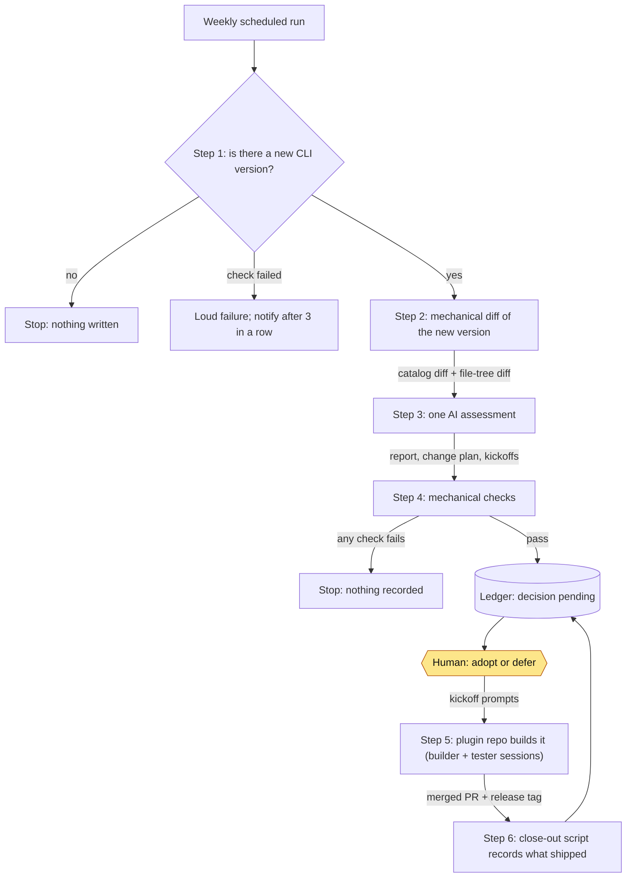

# gs-fortress: change control for a vendor CLI an agent depends on

> Part of the [gs-admin toolchain](../gs-admin-toolchain/README.md). It is the toolchain's
> upstream watch: it audits each new vendor CLI release and recommends whether to build on
> it. I make the call.
> Private repository · in use (weekly scheduled run) · measured 2026-10-05 at `origin/main`

## The problem

My public plugin, [gs-superadmin](https://github.com/BradleyDB/gs-admin-cli-docs), lets an
AI agent read and change a production SaaS admin configuration through the vendor's
command-line tool, `@gainsight/gs-admin-cli`. The vendor ships that CLI on its own schedule,
and a release can quietly change what a command does, what its output looks like, or
whether it writes. The plugin's safety guard is generated from the CLI's command catalog,
so if a release mislabels a writer as read-only, the guard learns the mistake at upgrade
time. Upgrading blind puts the agent's safety rails at risk. Never upgrading leaves the
plugin running on old behaviour and vendor fixes it can't use.

## What I built

- **A weekly release gate** that checks npm and returns exactly one of three answers: no
  change, a new version, or a failed check. A failed check is never reported as "up to
  date", and three failures in a row send a notification that the watcher itself is broken.
- **A mechanical delta** for each new version: a scratch install with install scripts
  disabled, a diff of the command catalog, and a file-tree diff that covers what the
  catalog can't see (runtime verbs, auth, package metadata).
- **One assessment agent per release** that walks a 13-item impact checklist, the
  known-issues ledger and the delta, then writes a fixed-shape report: regression risks,
  defects fixed or still open upstream, new capabilities, and a change plan.
- **Copy-paste build kickoffs** for each change plan. Each work item is marked gated (waits
  for the adopt decision) or ungated (needed whatever the decision, because users already
  run the new CLI).
- **A permanent decision ledger**: every audited version gets a report, a release-notes
  headline, and an adopt/defer entry that records the PRs and release tags that carried it
  out. Since September a script derives that line from GitHub instead of anyone typing it.
- **An upstream defect tracker**: 20 tracked CLI defects, 8 written up as reproducible,
  vendor-ready reports, and a walk on every audit that detects silent upstream fixes.

## The framework

1. **The agent recommends, a human decides.** The audit writes `decision: "pending"` and
   stops. The close-out script fills in `execution` from GitHub and never touches
   `decision`. Kickoff prompts carry a review header, and I read them before pasting any.
2. **Upstream code is untrusted data.** The package is installed with `--ignore-scripts`
   into a scratch folder. The assessment agent gets eight invariants restated verbatim,
   one of which says text inside the package is the thing under audit and never an
   instruction. Before anything is recorded, the global CLI install is checked to be
   unchanged.
3. **Read the dependency from its source of truth, never from a local copy.** Each run
   fetches the plugin repo's `dev` branch from GitHub into a private store, exports it with
   every file checked against its git blob id, and deletes the store. One script holds the
   repo's identity, and a test fails if it's restated anywhere else. This rule came from a
   finding: the watcher had been auditing against a clone that had stopped moving when the
   plugin repo went public.
4. **Fail loud, and never record an unsound audit.** If any verification fails, the
   ledger's `lastNotifiedVersion` isn't written. Writing it would silence the gate for that
   version for good.

## How it works



Every stage before the assessment is deterministic and cheap. Only one step uses
judgment, and its output is checked mechanically before it counts: the known-issues file
must pass a single table of rules (public-safe wording, one report per issue, an
acknowledgement never dated before its send), and the kickoffs file must pass a lint
against its template.

Adoption doesn't happen here. gs-fortress never writes to the plugin repo. The change plan
is executed on that repo's own dev-loop: a builder session works the change, a separate
tester session verifies it against a canary token that proves which build was loaded, and
the result ships as a PR and a release tag. The close-out script then reads that PR and tag
back through `gh` and refuses evidence that doesn't match the plan's session map.

**One cycle, end to end (CLI 1.0.10).** The vendor release changed no commands at all, so
the catalog diff was empty. The tree diff found a rewritten auth module and a raised Node
floor, and the audit turned those into four new regression items. They became two
permanent checklist items, numbers 12 and 13.

| Date | Step | Evidence |
|---|---|---|
| 2026-09-17 | Vendor publishes 1.0.10 | npm |
| 2026-09-21 | Audit: 5 risks affected, 2 known defects resolved, 2 new capabilities; recommend adopt | gs-fortress commit `b109854` (private) |
| 2026-09-22 | Decision: adopt | `ledger/state.json` (private) |
| 2026-09-26 | Plugin adoption merged, released | [gs-admin-cli-docs PR #27](https://github.com/BradleyDB/gs-admin-cli-docs/pull/27) · [v0.43.0](https://github.com/BradleyDB/gs-admin-cli-docs/releases/tag/v0.43.0) |
| 2026-10-04 | Checklist items 12–13 merged, released | gs-fortress PR #13, v0.6.0 (private) |

Sizes, merge commits and first containing tags are in [proof/trace.md](proof/trace.md).

The decision-log entry that cycle produced (abridged):

```json
"1.0.10": {
  "auditedOn": "2026-09-21",
  "recommendation": "adopt",
  "decision": "adopt",
  "decidedOn": "2026-09-22",
  "execution": "done 2026-10-04 — explorer PR #27 (merge 6acd1e4) executed
    E1 + V1 + E2; released as gs-superadmin 0.43.0; gs-fortress PR #13
    (merge 78e2f1b) executed F1; released as gs-fortress 0.6.0. Pending: B1 (owner)."
}
```

The impact checklist, as item titles (paraphrased, ordered by risk). Items 1–6 and 11–13
cover changes the plugin's own CI can't catch:

```text
 1. Sanctioned ask-override for a command the CLI labels read-only but that runs a job
 2. The computed count of "non-mutating" commands that actually write
 3. The exact-match list of read verbs
 4. New list commands → candidate knowledge-base domains
 5. Verbs the catalog extractor hardcodes
 6. The guard's secret-flag pattern
 7. Hand-written MCP tool names in prose
 8. Relationship-builder mapping semantics
 9. Prose asserting facts about the vendor's README
10. Bulk version-string prose (CI-caught)
11. Payload shapes the plugin reads, from a measured reader map
12. The CLI's auth module → the plugin's token-lifetime and auth-failure sites
13. The CLI's Node engine floor → the plugin's Node-version claims
```

## Proof

Measured 2026-10-05 at `origin/main` (`ff5ff42`). Commands run from the folder that holds
the clone; the full table, ledger counts included, with every command, is in
[proof/stats.md](proof/stats.md).

| Measure | Value | How to check |
|---|---|---|
| Vendor releases audited | 5 (1.0.6 to 1.0.10) | `git -C gs-fortress ls-tree --name-only ff5ff42 ledger/reports/ \| grep -cE '/audit-[0-9.]+\.md$'` |
| Adopt/defer decisions recorded | 5 (all adopt so far) | `git -C gs-fortress show ff5ff42:ledger/state.json \| grep -c '"decision":'` |
| Change plans handed to build sessions | 5 kickoff files | `git -C gs-fortress ls-tree --name-only ff5ff42 ledger/reports/ \| grep -cE '/build-kickoffs-[0-9.]+\.md$'` |
| Impact-checklist items | 13 | `git -C gs-fortress show ff5ff42:plugins/gs-fortress/skills/gs-admin-cli-watch/reference/impact-checklist.md \| grep -cE '^[0-9]+\. \*\*'` |
| Upstream CLI defects tracked | 20, of which 7 resolved upstream | `git -C gs-fortress show ff5ff42:ledger/known-issues.json \| grep -cE '"id": "KI-[0-9]+"'`; for resolved, the same with `grep -c '"status": "resolved"'` |
| Vendor-ready defect reports on file | 8 | `git -C gs-fortress ls-tree --name-only ff5ff42 ledger/upstream-feedback/reports/ \| grep -c '\.md$'` |
| dev-loop findings on this repo's own bus | 25, 24 verified | `git -C gs-fortress show ff5ff42:dev/FEEDBACK.md ff5ff42:dev/FEEDBACK-archive.md \| grep -oE '^## F-[0-9]+' \| sort -u \| wc -l` |
| Findings a tester sent back at least once | 8 of 25 | `git -C gs-fortress show ff5ff42:dev/FEEDBACK.md ff5ff42:dev/FEEDBACK-archive.md \| awk '/^## F-[0-9]+/{f=$2} /^Reopened/{print f}' \| sort -u \| wc -l` |
| Test suites | 6; 2,157 of 4,018 JavaScript lines are tests | `git -C gs-fortress ls-tree -r --name-only ff5ff42 plugins/gs-fortress/test \| grep -cE '\.test\.mjs$'` |
| History | 165 commits, 2026-07-27 to 2026-10-04, 16 active days, 8 release tags, 14 merged PRs | see [proof/stats.md](proof/stats.md) |

**Vendor acknowledgements, counted and dated from the ledger.** After the first audit I
sent the vendor a design-feedback memo. One reply is on file, dated 2026-07-30. The ledger
maps it onto 5 tracked defects, and 4 of those were resolved in 1.0.8, the first release
after the reply. The 8 defect reports went out in one batch on 2026-09-18, and no
acknowledgement of them is recorded yet. Two of the defects they describe were fixed in
1.0.10, which was published the day before that send. The audit records the timing itself,
so I make no claim that the reports caused those fixes.

## What this shows

For a CS-operations systems architect or agentic success lead role:

| Role duty | Where this work does it | Evidence |
|---|---|---|
| Decision log | Adopt/defer ledger: recommendation, decision, date, and an execution line derived from the PR and tag | 5 decisions, each with its report and kickoffs |
| Architecture principles | The four rules above, each enforced: ledger rules table, single-source test, zero-footprint check, `--ignore-scripts` | 6 test suites; 8 invariants restated to every agent |
| Dependency map | The impact checklist maps each part of the vendor CLI to the plugin code that depends on it, including a measured map of the payload shapes the plugin reads | 13 items, up from 8 at the first audit as later audits found new dependencies |
| Change control | Gate → audit → human decision → gated and ungated work items → PR → release tag → derived close-out | e.g. PR #27 → v0.43.0 |
| Agent evaluation | The assessment agent's output must pass mechanical checks before it's recorded; this repo's own changes go through builder/tester verification | 8 of 25 findings reopened by a tester before passing |
| Agent escalation | The agent stops and reports on any refused gate; adopt/defer is always human; the watcher reports its own breakage | 3-strike failure notification; `decision` never written by a script |

## What's private and why

- **Private:** gs-fortress itself. It's personal infrastructure: schedules, machine paths
  and notification state. Its ledger also holds vendor-ready bug reports, which are allowed
  to carry tenant identifiers. Nothing from those reports appears on this page. They're
  counted and dated only. The process skills it runs on (superfriends, the dev-loop) and
  the dev-utils CLI are private as well.
- **Public and checkable:** the plugin this repo protects,
  [gs-admin-cli-docs](https://github.com/BradleyDB/gs-admin-cli-docs), including the
  adoption [PR #27](https://github.com/BradleyDB/gs-admin-cli-docs/pull/27) and release
  [v0.43.0](https://github.com/BradleyDB/gs-admin-cli-docs/releases/tag/v0.43.0). That's
  the place to see the code.
- **Reproducible on request:** readers can't rerun the numbers above against a private
  repo. Each one is printed beside the command that produced it, and I'm happy to rerun
  any of them in a live walkthrough.
